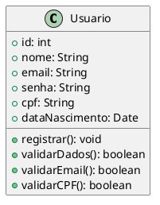

# História de Usuário 1 - Registro de Usuário (US001.1)

Como um usuário, quero me registrar na plataforma para poder acessar minha conta bancária.

## Cenário de Sucesso

    Given que estou na página de registro de usuário,
    When eu preencho todos os campos obrigatórios com dados válidos (nome, e-mail, senha) e clico no botão "Registrar",
    Then minha conta deve ser criada com sucesso e devo receber uma confirmação de que o registro foi realizado.

## Cenário de Erro: Campos Obrigatórios Não Preenchidos

    Given que estou na página de registro de usuário,
    When eu deixo um ou mais campos obrigatórios (nome, e-mail, senha) em branco e tento enviar o formulário,
    Then o sistema deve exibir uma mensagem de erro solicitando o preenchimento de todos os campos obrigatórios.

## Cenário de Erro: E-mail Inválido

    Given que estou na página de registro de usuário,
    When eu insiro um e-mail inválido e tento enviar o formulário,
    Then o sistema deve exibir uma mensagem de erro informando que o e-mail não é válido.

**cgatGpt:** crie a classe registro de usuário no formato diagram de classe para ser usado no projeto conta bancária. Crie a resposta no formato markdown.

# Diagrama de Classes

# Diagrama de Classes - Registro de Usuários

