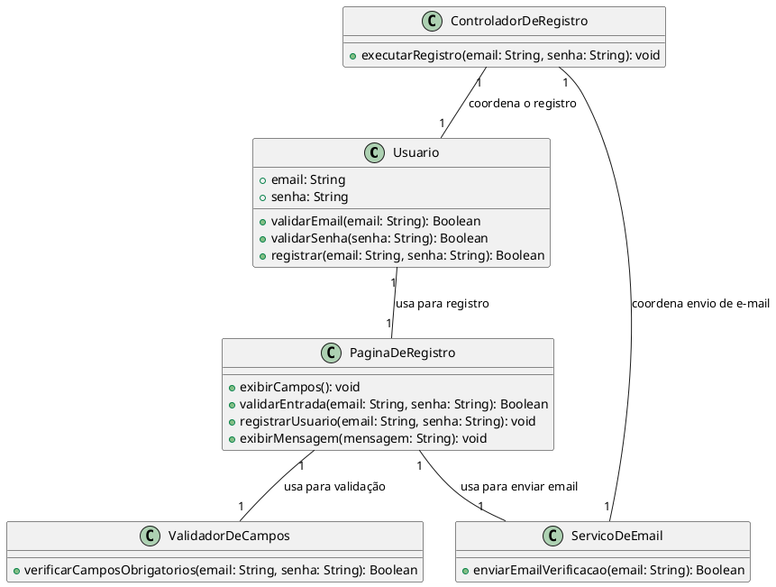

# Sprint 1 US001.3

## Checklist de Tarefas

## US001.3: Implementar registro de usuário com e-mail e senha

**História de Usuário:**
Como novo usuário, desejo me registrar criando uma conta com e-mail e senha, para que eu possa acessar os serviços bancários e gerenciar minha conta.

**Checklist:**

-   [ ] Criar a página de registro com campos para e-mail e senha.
-   [ ] Implementar a validação de entrada para e-mail e senha não vazios.
-   [ ] Implementar a lógica de registro para verificar se o e-mail já está em uso.
-   [ ] Desenvolver a funcionalidade para enviar um e-mail de verificação após o registro.
-   [ ] Implementar a confirmação de registro bem-sucedido e a verificação de e-mail.
-   [ ] Criar testes automatizados para os seguintes cenários:
    -   [ ] **Cenário: Registro bem-sucedido**
        -   [ ] Dado que o usuário está na página de registro,
        -   [ ] Quando ele preenche os campos de e-mail e senha e clica no botão de registrar,
        -   [ ] Então ele deve receber uma confirmação de que a conta foi criada com sucesso e deve receber um e-mail de verificação para confirmar seu e-mail.
    -   [ ] **Cenário: Registro com e-mail já em uso**
        -   [ ] Dado que o usuário está na página de registro,
        -   [ ] Quando ele preenche o campo de e-mail com um e-mail que já está registrado e tenta se registrar,
        -   [ ] Então ele deve ver uma mensagem de erro informando que o e-mail já está em uso e deve tentar um e-mail diferente.
    -   [ ] **Cenário: Campos obrigatórios em branco no registro**
        -   [ ] Dado que o usuário está na página de registro,
        -   [ ] Quando ele tenta se registrar sem preencher o e-mail ou a senha,
        -   [ ] Então ele deve ver uma mensagem de erro informando que os campos e-mail e senha são obrigatórios.

**cgatGpt:** transforme as histórias de usuários e cenários de teste em um diagram de classe para a funcionalidade registro de usuários no formato markdown:

# Diagrama de Classes

# Diagrama de Classes - Registro de Usuários

