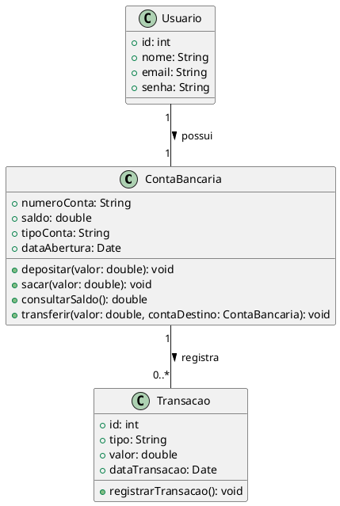

# História de Usuário 2 - Visualização do Saldo Bancário (US005.2)

Como um usuário, quero visualizar meu saldo bancário atual, para que eu possa saber quanto dinheiro tenho disponível.

## Cenário de Sucesso

    Given que estou na página de gerenciamento de conta,
    When eu solicito visualizar meu saldo bancário,
    Then devo ver o valor atualizado do meu saldo bancário.

## Cenário de Erro: Falha na Recuperação do Saldo

    Given que estou na página de gerenciamento de conta,
    When ocorre um erro ao tentar recuperar meu saldo bancário,
    Then devo ver uma mensagem de erro informando que não foi possível recuperar o saldo no momento.

# História de Usuário 3 - Depósito e Saque (US005.2)

Como um usuário, quero poder depositar e sacar dinheiro da minha conta, para que eu possa gerenciar minhas finanças.

## Cenário de Sucesso: Depósito

    Given que estou na página de depósito,
    When eu insiro um valor válido e clico em "Depositar",
    Then o valor deve ser adicionado ao meu saldo bancário e devo receber uma confirmação de depósito bem-sucedido.

## Cenário de Erro: Depósito de Valor Inválido

    Given que estou na página de depósito,
    When eu insiro um valor inválido (como um valor negativo ou zero) e clico em "Depositar",
    Then devo ver uma mensagem de erro informando que o valor deve ser válido.

## Cenário de Sucesso: Saque

    Given que estou na página de saque,
    When eu insiro um valor válido e clico em "Sacar",
    Then o valor deve ser subtraído do meu saldo bancário e devo receber uma confirmação de saque bem-sucedido.

## Cenário de Erro: Saque de Valor Inválido

    Given que estou na página de saque,
    When eu insiro um valor inválido (como um valor negativo ou zero) e clico em "Sacar",
    Then devo ver uma mensagem de erro informando que o valor deve ser válido.

## Cenário de Erro: Saque Acima do Saldo

    Given que estou na página de saque,
    When eu tento sacar um valor maior que meu saldo atual e clico em "Sacar",
    Then devo ver uma mensagem de erro informando que o saldo é insuficiente para realizar o saque.

**cgatGpt:** crie a classe conta bancária no formato diagram de classe para ser usado no projeto conta bancária. Crie a resposta no formato markdown.

# Diagrama de Classes

# Diagrama de Classe - Conta Bancária (Projeto Conta Bancária)

## Descrição das Classes

### **ContaBancaria**

-   **Atributos**:
    -   `numeroConta: String` - O número único da conta bancária.
    -   `saldo: double` - O saldo atual da conta.
    -   `tipoConta: String` - O tipo da conta (ex: corrente, poupança).
    -   `dataAbertura: Date` - A data de abertura da conta.
-   **Métodos**:
    -   `depositar(valor: double): void` - Adiciona o valor ao saldo da conta.
    -   `sacar(valor: double): void` - Subtrai o valor do saldo, se o saldo for suficiente.
    -   `consultarSaldo(): double` - Retorna o saldo atual da conta.
    -   `transferir(valor: double, contaDestino: ContaBancaria): void` - Transfere o valor para outra conta bancária.

### **Transacao**

-   **Atributos**:

    -   `id: int` - Identificador único da transação.
    -   `tipo: String` - Tipo da transação (ex: depósito, saque, transferência).
    -   `valor: double` - Valor envolvido na transação.
    -   `dataTransacao: Date` - A data em que a transação foi realizada.

-   **Métodos**:
    -   `registrarTransacao(): void` - Registra uma nova transação no histórico.

### **Usuario**

-   **Atributos**:
    -   `id: int` - Identificador único do usuário.
    -   `nome: String` - Nome completo do usuário.
    -   `email: String` - Endereço de e-mail do usuário.
    -   `senha: String` - Senha usada para autenticação.

## Relações

-   A classe `ContaBancaria` está associada a várias instâncias de `Transacao`, onde cada transação é registrada no histórico da conta.
-   Cada `Usuario` possui uma `ContaBancaria`, representando a relação entre o usuário e sua conta.

Esse diagrama é adequado para o gerenciamento de contas bancárias e transações no projeto de conta bancária, cobrindo as funcionalidades essenciais de depósito, saque, consulta de saldo e transferência entre contas.
